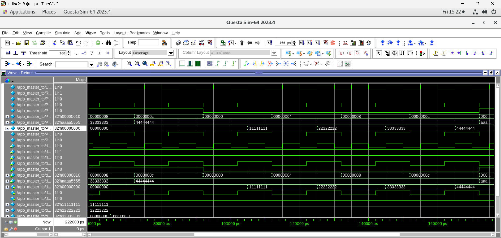

# APB Protocol Slave RTL Design

## Overview

This project implements an **AMBA APB (Advanced Peripheral Bus) slave** using Verilog HDL.

The APB slave is designed with an **FSM-based control mechanism** and provides a simple register interface for read and write operations. A Verilog testbench is used to verify the functionality through simulation.

## Features

* APB slave RTL design
* FSM-based control
* Supports APB read and write transactions
* Four 32-bit registers at addresses 0x00, 0x04, 0x08 and 0x0C
* PSLVERR error response for invalid addresses
* Verilog testbench for functional verification
* Simulation waveform included
* Designed using synthesizable Verilog HDL

## APB Signals

| Signal    |  Width | Description                      |
| --------- | :----: | -------------------------------- |
| `CLK`     |  1-bit | Clock signal                     |
| `RST`     |  1-bit | Reset signal                     |
| `PSEL`    |  1-bit | Peripheral select                |
| `PENABLE` |  1-bit | Enables the access phase         |
| `PWRITE`  |  1-bit | Selects read or write operation  |
| `PADDR`   | 32-bit | Address bus                      |
| `PWDATA`  | 32-bit | Write data                       |
| `PRDATA`  | 32-bit | Read data                        |
| `PREADY`  |  1-bit | Indicates completion of transfer |
| `PSLVERR` |  1-bit | Indicates a transfer error       |

## APB Transfer Phases

The APB transaction consists of two main phases:

### 1. Setup Phase

During the setup phase:

* `PSEL = 1`
* `PENABLE = 0`
* Address and control signals are valid.

### 2. Access Phase

During the access phase:

* `PSEL = 1`
* `PENABLE = 1`
* The slave performs the read or write operation.
* `PREADY` indicates when the transfer is complete.

## FSM

The APB slave uses three states:

```text
IDLE → SETUP → ACCESS
 ↑              |
 └──────────────┘
```

* **IDLE:** Waits for a peripheral selection.
* **SETUP:** Captures the APB transaction information.
* **ACCESS:** Performs the requested read/write operation.

## Project Files

| File               | Description             |
| ------------------ | ----------------------- |
| `apb.v`            | APB slave RTL design    |
| `apb_tb.v`         | Verilog testbench       |
| `apb.waveform.png` | APB simulation waveform |

## Simulation

The APB slave was verified with a directed Verilog testbench in QuestaSim. The testbench writes to all four registers, reads each value back, and performs a write and a read to an invalid address (0x10) to check the PSLVERR response. Results were checked through waveform analysis.

## Simulation Waveform

The following waveform shows the APB signals during simulation:



## Tools & Technologies

* Verilog HDL
* QuestaSim
* RTL Design
* APB Protocol

## Learning Outcomes

Through this project, I practiced:

* APB protocol fundamentals
* FSM-based RTL design
* Verilog RTL coding
* APB read and write transactions
* Testbench development
* Functional simulation
* Waveform analysis

## Author

Juhi Patel

Electronics & Communication Engineering | VLSI | Verilog | RTL Design


